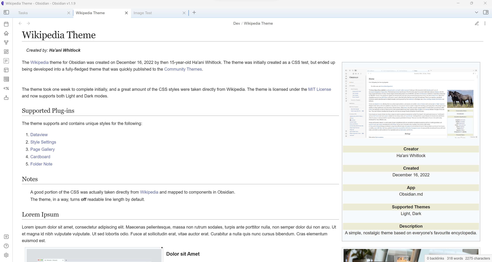

 

# Familiar Look
Make your vault look like your own personal Wikipedia! This theme styles images, headings, and even the sidebar in the classic style of your favourite encyclopedia.

# Infoboxes
Any **Info** blockquote (created using `>[!info]`) will float to the right of the note like an infobox. Inline dataview fields inside these **Info** blockquotes will be displayed on separate lines, styled like Wikipedia's infobox headings and descriptions (see image above). You can also create an infobox heading with a yellow background by adding a **Heading 6**. 
>Tip - Hide the infobox callout's title with the Style Settings plug-in for a cleaner look.

# Update
- All images will now float except those placed inside callouts.
  - An image directly after another image will float to the left instead of the right.
- The info callout is now the only callout that will float to the right. For simplicity, infobox blockquotes can no longer float to the right, either.
- Dark mode has been updated.
- Callouts have a new look!
- Multiple changes to typography
  - Default font changed to **Arial**
  - Modifications to Headings
- Images now have the signature Wikipedia border around them.

# Notes
- I'm not a theme developer or anything, just a 15-year-old who likes to waste time with CSS.
- A good chunk of the CSS *was* actually taken directly from Wikipedia and mapped to components in Obsidian.
- Feel free to make pull requests or suggestions for this theme. Or remix it into your own thing. It's under the MIT license.
## Screenshots (Outdated)

*Wikipedia-style headings*

*Dataview Support*

*Square checkboxes*

*Floating images & callouts; Wikipedia-style links*
