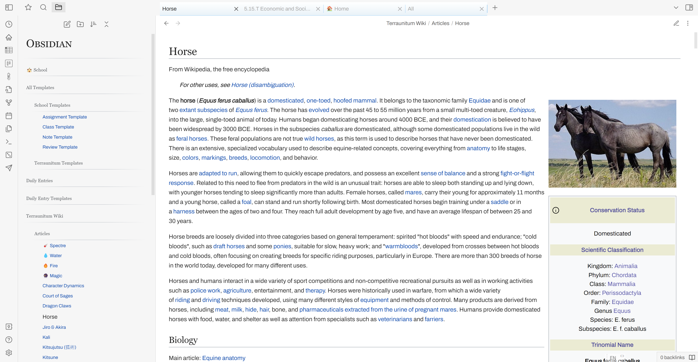

A theme designed to make your Obsidian workspace look and feel like wikipedia.org! 

## ⭐ Features
- Wikipedia-style headings, titles, tabs, sidebars, and more.
- Support for inline metadata and tables created with the Dataview plugin.
- Images and callouts float to the side.
- Works on mobile devices.

## ☝🏽 Notes
- Much of the css was taken directly from wikipedia.org.
- This theme makes dividers invisible. 
  - This his because Wikipedia articles do not use dividers. 
    - Also, I thought some people might already have dividers below Heading 1 for stylizing reasons, and that would look messy with Heading 1 already having a bottom border in this theme.
- For optimal viewing quality, go to **Editor** in **Settings** and **turn off *Readable Line Length***.
- This theme is not compatible with dark mode.
- I'm not a theme developer or anything, just a 15-year-old who likes to play with css.

***

*Wikipedia-style headings*

*Dataview Support*

*Square checkboxes*

*Floating images & callouts; Wikipedia-style links*
