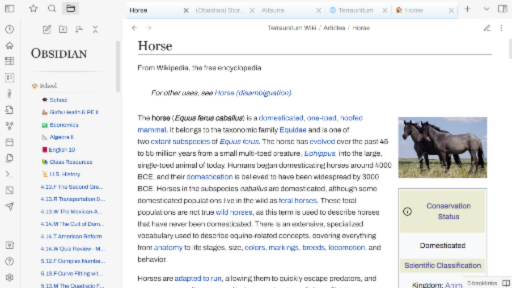

A theme designed to make your Obsidian workspace look and feel like [Wikipedia](wikipedia.org)! 

## ⭐ Features
- Wikipedia-style headings, titles, tabs, sidebars, and more.
- Support for inline metadata and tables created with the Dataview plugin.
- images and callouts float to the side.

## ☝🏽 Notes
- Much of the css was taken directly from wikipedia.org.
- This theme makes dividers invisible. 
  - This is because Wikipedia articles do not use dividers. 
- This theme is not compatible with dark mode.
- I'm not a theme developer or anything, just a 15-year-old who likes to play with css.
