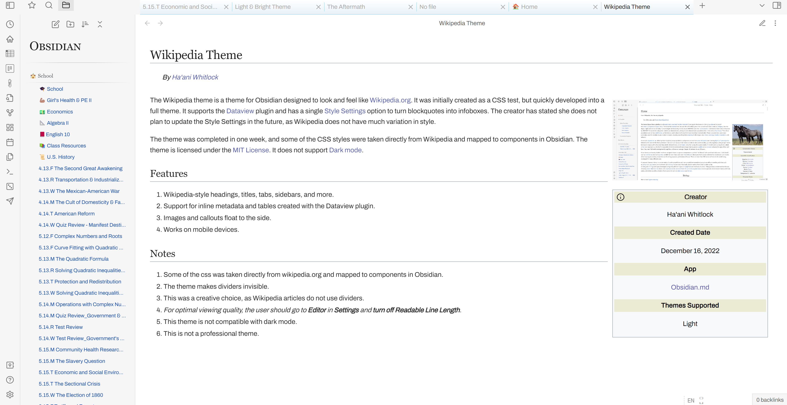
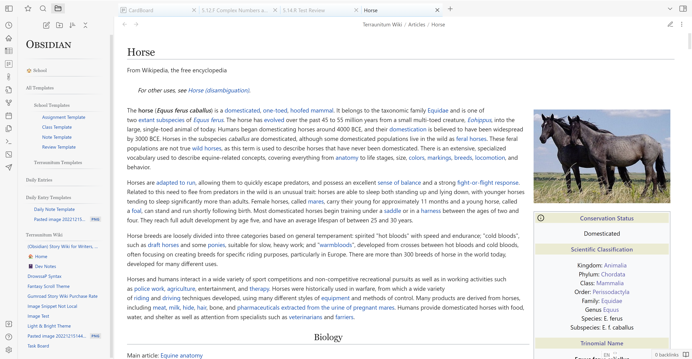
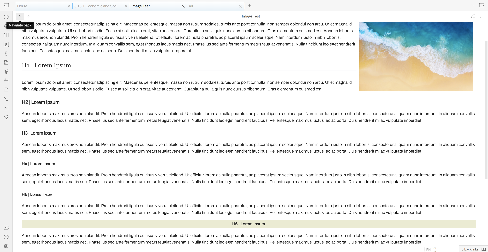
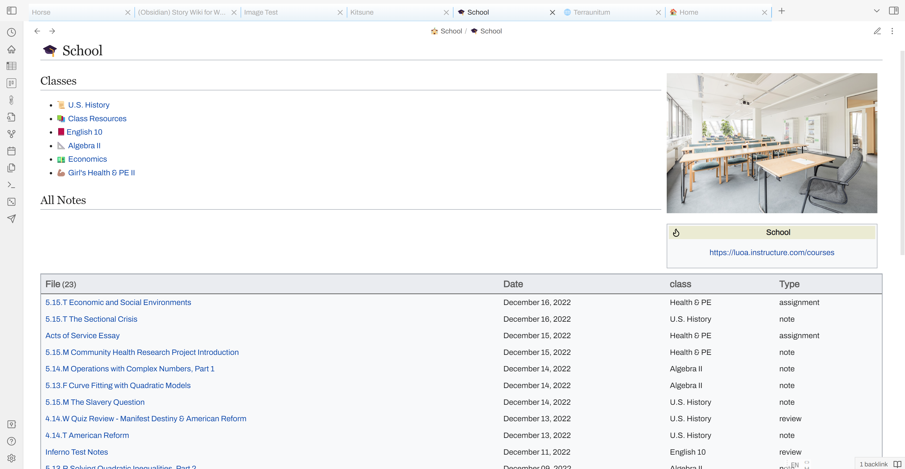
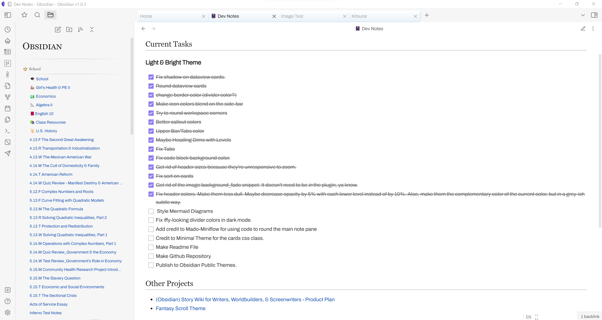
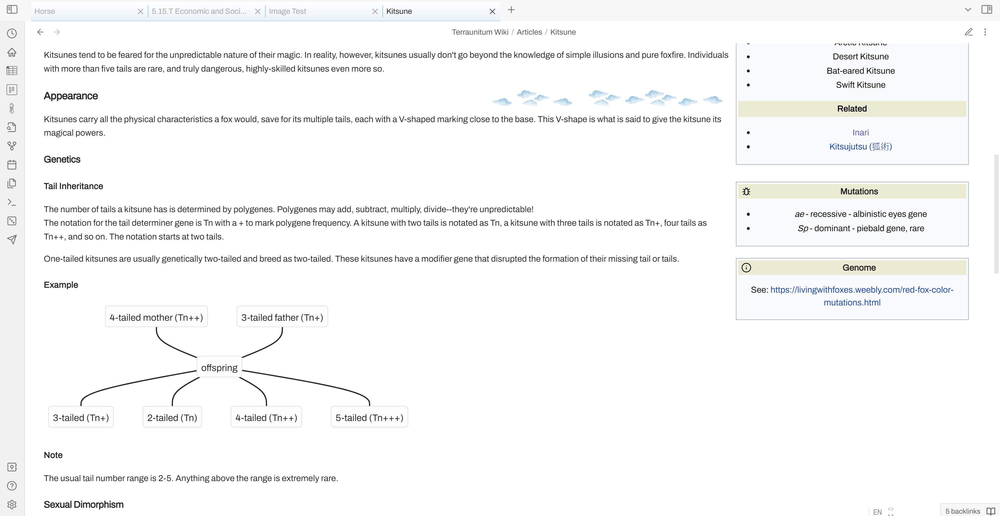

A theme designed to make your Obsidian workspace look and feel like wikipedia.org! 

## ⭐ Features
- Wikipedia-style headings, titles, tabs, sidebars, and more.
- Support for inline metadata and tables created with the Dataview plugin.
- Images and callouts float to the side (Can be changed with style settings).
- Works on mobile devices.

## ☝🏽 Notes
- Some of the css was taken directly from wikipedia.org and mapped to components in Obsidian.
- This theme makes dividers invisible. 
  - This was a creative choice, as Wikipedia articles do not use dividers. 
- *For optimal viewing quality, go to **Editor** in **Settings** and **turn off Readable Line Length***.
- I'm not a theme developer or anything, just a 15-year-old who likes to play with css.

## 🎉 Update
- Now supports Dark Mode!
### 🎨 Style Settings
- You can now choose to use your own accent color rather than Wikipedia's blue!
- Blockquotes can be formatted either like Wikipedia quotes or like infoboxes
- Images and infoboxes can be centered (I recommend this if you'd like to keep Readable Line Length turned off)
- You can now change image size (only applied if images are centered)
## ❗ Got Ideas for Improvement? I'd Love to Hear Them!
If you find any issues you know how to fix or you have modifications you'd like me to merge into the theme, please let me know. I barely know css and just did this as a fun project, but if you find any ways to make this theme better, I'd love to hear them.

## Screenshots 

*Wikipedia-style headings*

*Dataview Support*

*Square checkboxes*

*Floating images & callouts; Wikipedia-style links*
